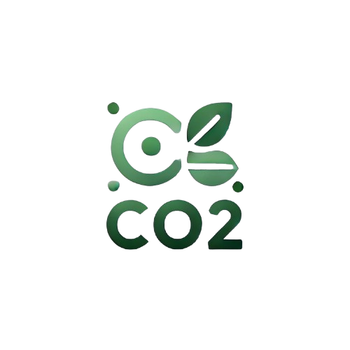

# SmartEcoIA - CO₂ Prediction API



Welcome to **SmartEcoIA**, an API that predicts weekly CO₂ emissions based on various user data. This project aims to raise awareness about carbon emissions and encourage more eco-friendly behaviors.

---

## 🌟 Features

- **CO₂ Emission Prediction**: Based on data such as energy consumption, mode of transport, and much more.
- **REST API**: Easy to use via tools like Postman or integrated into web and mobile applications.
- **Cloud Deployment**: Hosted on Azure for global accessibility.

---

## 🚀 Access Link

- Access the API via: [SmartEcoIA - Azure Deployment](https://smartecoia-fuhxfhhrfpajg4gs.francecentral-01.azurewebsites.net/)

---

## 📖 API Documentation

### **1. Home Endpoint**

- **URL**: `/`
- **Method**: `GET`
- **Description**: Provides basic information about the API.

**Example Response:**
```json
{
    "message": "Welcome to the CO2 Prediction API!",
    "description": "This API predicts weekly CO2 emissions based on user input data.",
    "routes": {
        "/health": "Check the health status of the API.",
        "/predict": "POST endpoint to make predictions. Requires specific input fields in JSON format."
    },
    "example_input": {
        "Sex": "Male",
        "Age": 35,
        "Country": "France",
        "Consumption_KWh": 1237,
        "Transport_Mode": "Car (diesel)",
        "Distance_KM": 1648,
        "Energy_Class": "C",
        "House_Area_M2": 150
    }
}
```

### **2. Health Endpoint**

- **URL**: `/health`
- **Method**: `GET`
- **Description**: Checks if the API is active and operational.

**Example Response:**
```json
{
    "status": "API is running"
}
```

### **3. Prediction Endpoint**
- **URL**: `/predict`
- **Method**: `POST`
- **Description**: Predicts weekly CO₂ emissions based on user data.

**Expected Data (JSON):**
```json
{
    "Sex": "Male",
    "Age": 35,
    "Country": "France",
    "Consumption_KWh": 1237,
    "Transport_Mode": "Car (diesel)",
    "Distance_KM": 1648,
    "Energy_Class": "C",
    "House_Area_M2": 150
}
```

**Example Response:**
```json
{
    "prediction": 12.34
}
```

## 🛠️ Local Installation

### **1. Prerequisites**
- **Docker**
- **Python 3.9+**
- **Azure CLI (if you want to redeploy)**

### **2. Clone the Project**

```bash
git clone https://github.com/Aboubakar-Ali/SmartEcoIA-CO2-Prediction-API.git

```

### **3. Build the Docker Image**
```bash
docker build -t flask-co2-api .
```
### **4. Run the Docker Container**
```bash
docker run -p 8888:5000 flask-co2-api
```

### **5. Access the API Locally**

- **Open http://127.0.0.1:8888 in your browser or test with Postman.**

## 🌐 Deployment on Azure

### **1. Tag the Docker Image:**
```bash
docker tag flask-co2-api <your-acr-name>.azurecr.io/flask-co2-api:latest
```

### **2. Push the Image to Azure Container Registry:**
```bash
docker push <your-acr-name>.azurecr.io/flask-co2-api:latest
```

### **3. Configure Azure App Service:**
- **Connect Azure App Service to your deployed image.**
- **Restart the service to apply updates.**

## 🧪 Testing with Postman

### *1. Import the API URL into Postman.*
### *2. Test the routes /, /health, and /predict.*
### *3. Provide a valid JSON body for /predict.*

## 🤝 Contributions

Contributions are welcome! Create a pull request or open an issue to discuss new ideas.

## 📝 License
This project is licensed under the MIT License. You are free to use and modify it as needed.

## 📧 Contact
For any questions, you can contact me at: aboubakaraliabdoulaziz@yahoo.com
